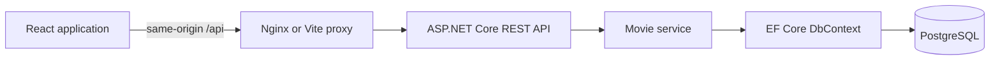

# FrameFinder Movie Search

## 1. Overview

FrameFinder is a full-stack movie catalog application. Users can search by movie title, genre, actor name, or any combination of those criteria. Results and selected movie details remain on one responsive page without a full page reload.

The application includes:

- Case-insensitive partial search with AND semantics across non-empty criteria.
- Movie summaries with genre and release date.
- Detailed descriptions and ordered cast lists.
- Loading, empty, error, retry, selection, and clear/reset states.
- PostgreSQL seed data for immediate use.
- Production-oriented Docker images and Docker Compose orchestration.
- PostgreSQL-backed backend tests and frontend behavior/accessibility tests.

Implementation progress and verification evidence are recorded in [IMPLEMENTATION_STATUS.md](IMPLEMENTATION_STATUS.md).

## 2. Architecture



### Backend

`MovieSearch.Api` is an ASP.NET Core controller API. Controllers own HTTP concerns, `MovieService` owns query behavior, and `MovieDbContext` owns persistence. EF Core is used directly instead of adding a repository layer that would duplicate its query and unit-of-work abstractions.

Responses use dedicated DTOs. EF entities are never returned by the API. Dependency injection wires the service and context, while ASP.NET Core supplies model validation, Problem Details, logging, cancellation tokens, CORS, OpenAPI, and health checks.

### Frontend

The React application uses functional components only. A small Redux slice owns draft criteria, submitted criteria, explicit search revisions, and the selected movie ID. RTK Query is the dedicated typed HTTP and cache layer. MUI provides accessible controls and responsive layout primitives.

### Database

PostgreSQL stores movies, genres, actors, and explicit movie/actor join rows. Migrations define the schema and deterministic seed data. Search predicates execute in PostgreSQL rather than loading all rows into application memory.

### Communication

During local development, Vite proxies `/api` to the API at `http://localhost:5045`. In Docker, Nginx serves the production React bundle and proxies `/api` to the internal `api:8080` service. The browser therefore uses same-origin requests in both environments.

## 3. Technology Stack

### Backend

- .NET SDK and ASP.NET Core 10
- C# with nullable reference types
- Entity Framework Core 10.0.11
- Npgsql EF Core provider 10.0.0
- PostgreSQL 17
- ASP.NET Core OpenAPI and Problem Details
- xUnit 2.9.3
- `WebApplicationFactory`
- Testcontainers for PostgreSQL 4.14.0
- Coverlet collector 6.0.4

### Frontend

- Node.js 24 and npm
- React 19.2.8
- TypeScript 6.0.2
- Vite 8.2.1
- Redux Toolkit and RTK Query 2.12.0
- React Redux 9.3.0
- MUI 9.3.1 and Emotion
- Lucide React icons
- Manrope and Newsreader variable fonts
- Vitest 4.1.10
- Testing Library, MSW, and axe-core

### Operations

- Docker and Docker Compose
- Multi-stage .NET and Node builds
- Unprivileged ASP.NET Core and Nginx runtime containers
- Nginx 1.29 Alpine

## 4. Database

### Entities

| Entity | Important fields |
| --- | --- |
| `Movie` | `Id`, `Title`, `Description`, `ReleaseDate`, `GenreId` |
| `Genre` | `Id`, `Name` |
| `Actor` | `Id`, `Name` |
| `MovieActor` | Composite key: `MovieId`, `ActorId` |

### Relationships

- One genre has many movies.
- Each movie has one primary genre.
- Movies and actors have a many-to-many relationship through `MovieActor`.
- Deleting a movie or actor cascades to its join rows.
- Genre deletion is restricted while movies reference it.

### Search indexes

- PostgreSQL `pg_trgm` extension.
- GIN trigram indexes on movie title and actor name.
- Unique index on genre name.
- Foreign-key indexes for genre and actor lookups.

### Migrations and seed data

The initial migration is under `backend/src/MovieSearch.Api/Data/Migrations`. It creates all tables, relationships, indexes, `pg_trgm`, and seed rows.

The seed contains:

- 9 movies
- 5 genres
- 15 actors
- 20 movie/actor relationships

Every seeded movie has at least one actor. The data supports individual and combined title, genre, and actor searches.

## 5. API

The default direct API URL is `http://localhost:5045`. The frontend uses the same endpoints through `/api`.

### Search movies

```http
GET /api/movies?title=Matrix&genre=Action&actor=Keanu
```

All parameters are optional query-string values. There is no request body.

| Parameter | Maximum length | Behavior |
| --- | ---: | --- |
| `title` | 200 | Case-insensitive partial title match |
| `genre` | 100 | Case-insensitive partial genre match |
| `actor` | 200 | Case-insensitive partial actor-name match |

Non-empty criteria are combined with AND. Empty or whitespace-only criteria do not restrict the query. With no criteria, all movies are returned in title and release-date order. User-provided `%`, `_`, and backslash characters are treated literally.

Successful response:

```json
[
	{
		"id": 1,
		"title": "The Matrix",
		"genre": "Action",
		"releaseDate": "1999-03-31"
	}
]
```

No matches return HTTP `200` with `[]`. Invalid lengths return HTTP `400` with validation Problem Details.

### Get movie details

```http
GET /api/movies/1
```

Successful response:

```json
{
	"id": 1,
	"title": "The Matrix",
	"genre": "Action",
	"description": "A hacker discovers that reality is a simulation and joins a rebellion against its controllers.",
	"releaseDate": "1999-03-31",
	"actors": [
		{ "id": 3, "name": "Carrie-Anne Moss" },
		{ "id": 1, "name": "Keanu Reeves" },
		{ "id": 2, "name": "Laurence Fishburne" }
	]
}
```

- A non-positive ID returns HTTP `400` validation Problem Details.
- An unknown positive ID returns HTTP `404` Problem Details.

### Health

```http
GET /health
```

Returns HTTP `200` with `Healthy` when the API process is running. This is a liveness endpoint; database readiness is controlled by Compose startup health and migration completion.

### General error behavior

- Validation errors: HTTP `400` with `ValidationProblemDetails`.
- Missing movie: HTTP `404` with sanitized `ProblemDetails`.
- Unhandled errors: HTTP `500` with sanitized Problem Details in production.
- Request cancellation is propagated through controller, service, and EF Core operations.

Development OpenAPI JSON is available at `/openapi/v1.json` when `ASPNETCORE_ENVIRONMENT=Development`.

## 6. Frontend

### Organization

```text
frontend/src/
├── api/                         # RTK Query API and error normalization
├── app/                         # Store, typed hooks, and MUI theme
├── features/movies/
│   ├── components/              # Search form, results, and details
│   ├── MovieSearchPage.tsx      # Feature orchestration
│   ├── moviesSlice.ts           # Criteria, submission, and selection state
│   └── types.ts                 # Typed API contracts
└── test/                        # MSW server and global test setup
```

### Redux state

The movie slice stores:

- Draft title, genre, and actor criteria.
- The last submitted criteria.
- A revision incremented by every explicit search submission.
- The selected movie ID.

The revision ensures a user can retry a failed request with unchanged criteria. RTK Query owns request state, response data, caching, and API errors.

### UI states

- Initial search form
- Search loading skeleton
- API error with same-criteria retry
- Empty result state
- Search result list and selected result
- Details loading skeleton
- Details error and recovery through another selection
- Full description, release date, genre, and cast
- Clear/reset, including while a request is in flight

Results render directly below the form. At desktop widths, results and details use adjacent columns. At mobile widths, details follow results in source order.

### API configuration

`VITE_API_BASE_URL` controls the frontend API base URL. It defaults to `/api`, which works with both Vite and Nginx proxying.

## 7. Running Locally

### Prerequisites

- .NET SDK 10
- Node.js 24 and npm
- Docker Engine for PostgreSQL and backend integration tests

The commands below use Windows PowerShell from the repository root.

### 1. Start PostgreSQL

```powershell
docker compose --env-file .env.example up --detach --wait database
```

### 2. Configure the API connection

```powershell
$env:ConnectionStrings__MovieDatabase = "Host=localhost;Port=5432;Database=movie_search;Username=movie_search;Password=movie_search_local"
```

### 3. Restore tools, apply migrations, and run the API

```powershell
dotnet tool restore
dotnet restore backend/MovieSearch.sln
dotnet tool run dotnet-ef database update `
	--project backend/src/MovieSearch.Api/MovieSearch.Api.csproj `
	--startup-project backend/src/MovieSearch.Api/MovieSearch.Api.csproj
dotnet run --project backend/src/MovieSearch.Api/MovieSearch.Api.csproj
```

The API listens at `http://localhost:5045` through the checked-in launch profile.

### 4. Install and run the frontend

In a second PowerShell terminal:

```powershell
npm --prefix frontend ci
npm --prefix frontend run dev
```

Open `http://localhost:5173`.

### Local environment cleanup

```powershell
Remove-Item Env:ConnectionStrings__MovieDatabase -ErrorAction SilentlyContinue
docker compose --env-file .env.example down
```

## 8. Docker

### Start the complete application

Create a local environment file and change the password if desired:

```powershell
Copy-Item .env.example .env
docker compose up --build --wait
```

Open `http://localhost:8080`.

Published loopback-only ports:

| Service | URL or port |
| --- | --- |
| Frontend | `http://localhost:8080` |
| API | `http://localhost:5045` |
| PostgreSQL | `localhost:5432` |

Compose waits for PostgreSQL before starting the API and waits for the API before starting the frontend. The API applies pending migrations when `Database__ApplyMigrations=true`. This is appropriate for this single-instance assignment; multi-replica production systems should use a dedicated migration job.

### Stop the application

```powershell
docker compose down
```

Database data remains in the named volume. To reset the database and seed data:

```powershell
docker compose down --volumes
docker compose up --build --wait
```

### Environment variables

| Variable | Local default | Purpose |
| --- | --- | --- |
| `POSTGRES_DB` | `movie_search` | Database name |
| `POSTGRES_USER` | `movie_search` | Database user |
| `POSTGRES_PASSWORD` | `movie_search_local` | Local database password |
| `POSTGRES_PORT` | `5432` | Host database port |
| `API_PORT` | `5045` | Host direct-API port |
| `APP_PORT` | `8080` | Host frontend port |

Do not use `.env.example` defaults for an internet-facing deployment. `.env` files are ignored by Git. Use a secret manager or deployment environment variables outside local development.

For a separate-origin frontend deployment, configure each allowed origin with ASP.NET Core array syntax such as `Cors__AllowedOrigins__0=https://movies.example.com`. The Compose deployment is same-origin through Nginx and also configures its published local origins explicitly. Unconfigured origins are denied.

The frontend container returns plain-text `healthy` from `/healthz`. The API returns plain-text `Healthy` from `/health`. Docker relies on their HTTP status codes rather than response casing.

### Troubleshooting

| Symptom | Resolution |
| --- | --- |
| A published port is already in use | Stop the other process or change `APP_PORT`, `API_PORT`, or `POSTGRES_PORT` in `.env`. |
| API logs report a database connection failure | Wait for `database` to become healthy, verify the PostgreSQL variables, then run `docker compose up --wait` again. |
| Local API reports a missing relation | Apply EF migrations using the commands in section 9. Compose applies them automatically. |
| Frontend displays a service error | Check `docker compose ps`, then inspect `docker compose logs api frontend`. |
| The database should be reseeded | Run `docker compose down --volumes`, then start the stack again. |
| Browser E2E tests cannot launch Chromium | Run `npm --prefix frontend run test:e2e:install`. |

## 9. Database Migrations

Restore the repository-local EF CLI:

```powershell
dotnet tool restore
```

Create a migration:

```powershell
dotnet tool run dotnet-ef migrations add MigrationName `
	--project backend/src/MovieSearch.Api/MovieSearch.Api.csproj `
	--startup-project backend/src/MovieSearch.Api/MovieSearch.Api.csproj `
	--output-dir Data/Migrations
```

Apply migrations to the configured database:

```powershell
dotnet tool run dotnet-ef database update `
	--project backend/src/MovieSearch.Api/MovieSearch.Api.csproj `
	--startup-project backend/src/MovieSearch.Api/MovieSearch.Api.csproj
```

Check model/snapshot synchronization:

```powershell
dotnet tool run dotnet-ef migrations has-pending-model-changes `
	--project backend/src/MovieSearch.Api/MovieSearch.Api.csproj `
	--startup-project backend/src/MovieSearch.Api/MovieSearch.Api.csproj
```

Connection strings are read from `ConnectionStrings:MovieDatabase`. Environment variables use the ASP.NET Core form `ConnectionStrings__MovieDatabase`.

## 10. Testing

Docker must be running for backend tests because they create an isolated PostgreSQL 17 Testcontainer.

### Backend

```powershell
dotnet test backend/MovieSearch.sln --configuration Release
```

The backend suite covers search combinations, empty and no-result searches, escaping, trimming, validation boundaries, CORS, health, details, ordered cast, missing and invalid IDs, and cancellation propagation.

Collect backend coverage:

```powershell
dotnet test backend/MovieSearch.sln `
	--configuration Release `
	--collect:"XPlat Code Coverage"
```

### Frontend

```powershell
npm --prefix frontend ci
npm --prefix frontend test
npm --prefix frontend run test:coverage
npm --prefix frontend run lint
npm --prefix frontend run build
```

Frontend coverage thresholds are enforced in `frontend/vite.config.ts`:

- Statements: 85%
- Lines: 85%
- Functions: 85%
- Branches: 75%

The current suite covers Redux transitions, API error normalization, combined search, same-page behavior, loading, empty, error and recovery states, details, keyboard selection, clear during requests, maximum lengths, and semantic accessibility with axe-core.

### Browser end-to-end tests

Playwright targets the canonical Docker Compose application at `http://127.0.0.1:8080` by default.

```powershell
docker compose up --build --wait
npm --prefix frontend run test:e2e:install
npm --prefix frontend run test:e2e
```

Set `PLAYWRIGHT_BASE_URL` to target another deployed stack. The suite runs desktop and mobile Chromium projects and verifies the real combined-search/details/clear workflow, horizontal containment, and mobile result/detail stacking.

### Dependency audits

```powershell
dotnet list backend/MovieSearch.sln package --vulnerable --include-transitive
npm --prefix frontend audit
```

## 11. Design Decisions

- **PostgreSQL `ILIKE` and trigram indexes:** Provide understandable case-insensitive partial matching while keeping filters in the database.
- **Explicit `MovieActor`:** Makes the many-to-many relationship and composite key visible and testable.
- **One primary genre per movie:** Matches the assignment's singular `Genre` model and avoids adding an unrequested join table.
- **No repository wrapper:** EF Core already supplies query and unit-of-work behavior; another repository would add ceremony without isolation value.
- **DTO projection:** Queries select only API contract data and avoid exposing tracked entities or causing N+1 requests.
- **Empty criteria return all movies:** This is predictable and demonstrates the seed catalog immediately.
- **Literal wildcard input:** `%`, `_`, and backslash do not silently broaden a user's search.
- **RTK Query plus a small slice:** Server state stays in the API cache, while only workflow state is manually modeled.
- **Explicit search revisions:** Every Search command can retry even when criteria are unchanged.
- **Same-page workflow:** Search and details require no route change or full reload.
- **Same-origin production proxy:** Simplifies deployment and avoids unnecessary browser CORS dependence.
- **Opt-in startup migrations:** Local tests and manual workflows retain control; the single-instance Compose API can initialize itself safely.
- **Unprivileged runtime images:** Both application containers avoid root execution.
- **Meaningful tests over test count:** Real PostgreSQL verifies query translation; MSW verifies typed frontend behavior; axe-core catches semantic regressions.

## 12. Assumptions

- A movie has one primary genre and one or more actors.
- The catalog is read-only for this assignment; create, update, and delete endpoints are out of scope.
- Search result volume is small enough to return without pagination. Pagination should be added before using a large production catalog.
- English UI copy and `en-US` release-date formatting are acceptable.
- Local Docker defaults are development conveniences, not production credentials.
- Docker Compose runs one API instance, allowing startup migration application without competing replicas.
- Persistent browser end-to-end tests target the canonical Docker Compose stack rather than separately managed development processes.